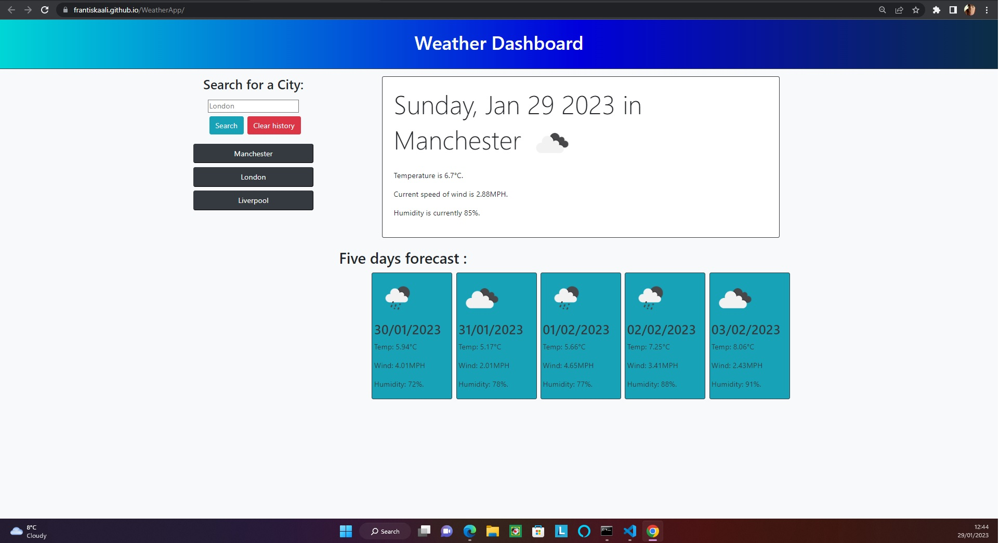

# WeatherApp
Weather application challenge for Trillogy Bootcamp class.
## Description
This simple browser weather app was made with Bootstrap,jQuery, open weather api and moment.js and it is interactive way app to find weather in major cities. (Even in small towns however states are not specified so it will always return the most known city if cities have same names).
### What have I learned 
Working on this challenge helped me to:
- deepen my knowladge of Bootstrap  styling,sizing and positioning classes
- practise and understand way of ajax calls in jQuerry
- practise creating my elements dynamically in script
- get familiar with openweather api and more practise with moment.js
- improve my local storage skills
- practise writting script using jQuery
## Usage
Simply enter name of desired city in and press search button. Box of current weather forescast and row with five days forecast will appear. Also with your search a history button will be created on the left side of the page so you can refer to your city again any time. The history search data will be saved in local storage and available for you even when page has been refreshed.
## Screenshot
This is how my deployed application looks :

## Link
[Here](https://frantiskaali.github.io/WeatherApp/) you can find my deployed application.
## Credits
Apis used: 
- https://openweathermap.org/
- https://jquery.com/
- https://momentjs.com/
## Room for improvement
If I have time to come back to this project, I would like to add function that specifies properly which town's forecast I would like to see and adding Remove buttons to each city history. Also it would be nice if I could prevent button creating if city found a second time.

